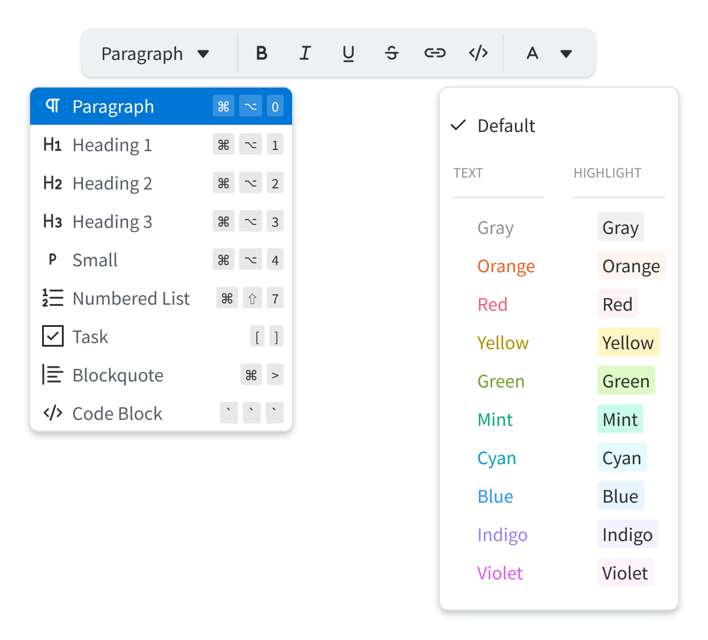
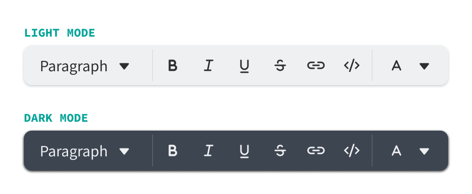

<link rel="stylesheet" href="docs/readme.css">

# Text Style plugin for Logseq

This is a Logseq plugin that enables a broader range of text styling via a floating toolbar.

<picture>
  <source srcset="docs/dark/text-style-toolbar.png" media="(prefers-color-scheme: dark)">
  
</picture>

## Functionality

### Block-level styling

<table>
  <thead>
      <tr>
        <th>Trigger</th>
        <th>Markdown</th>
        <th>Hotkey</th>
      </tr>
  </thead>
  <tbody>
    <tr>
      <td colspan="3">
        <picture>
          <source srcset="docs/dark/text-style-block-options.png" media="(prefers-color-scheme: dark)">
          
        </picture>
      </td>
    </tr>
    <tr>
      <td>
        <div class="-ts-flex">
          <svg class="-ts-icon -ts-dimmed" alt="Paragraph SVG" width="24" height="24" fill="none" xmlns="http://www.w3.org/2000/svg"><path d="M17 6.25h-6.5a4.26 4.26 0 0 0-4.25 4.25 4.26 4.26 0 0 0 4.25 4.25h.75V17c0 .41.34.75.75.75s.75-.34.75-.75V7.75h1.5V17c0 .41.34.75.75.75s.75-.34.75-.75V7.75H17c.41 0 .75-.34.75-.75s-.34-.75-.75-.75Zm-5.75 7h-.75c-1.52 0-2.75-1.23-2.75-2.75s1.23-2.75 2.75-2.75h.75v5.5Z" fill="currentColor"/></svg>
          Paragraph
        </div>
      </td>
      <td><span class="-ts-dimmed">text</span></td>
      <td>
        <div class="-ts-hotkeys">
          <div class="-ts-key">⌘</div>
          <div class="-ts-key">⌥</div>
          <div class="-ts-key">0</div>
        </div>
      </td>
    </tr>
    <tr>
      <td>
        <div class="-ts-flex">
          <svg class="-ts-icon -ts-dimmed" alt="Heading 1 SVG" width="24" height="24" fill="none" xmlns="http://www.w3.org/2000/svg"><path d="M10.75 7c0-.41.34-.75.75-.75s.75.34.75.75v10c0 .41-.34.75-.75.75s-.75-.34-.75-.75v-4.25h-4.5V17c0 .41-.34.75-.75.75s-.75-.34-.75-.75V7c0-.41.34-.75.75-.75s.75.34.75.75v4.25h4.5V7Zm6.5 9.25h1.25c.41 0 .75.34.75.75s-.34.75-.75.75h-4c-.41 0-.75-.34-.75-.75s.34-.75.75-.75h1.25v-5.04l-.91.47c-.37.18-.82.03-1.01-.34a.75.75 0 0 1 .33-1.01l2-1c.23-.12.51-.11.73.03.23.14.36.38.36.64v6.25Z" fill="currentColor"/></svg>
          <span>Heading 1</span>
        </div>
      </td>
      <td># <span class="-ts-dimmed">text</span></td>
      <td>
        <div class="-ts-triggers">
          <div class="-ts-hotkeys">
            <div class="-ts-key">⌘</div>
            <div class="-ts-key">⌥</div>
            <div class="-ts-key">1</div>
          </div>
          <div class="-ts-slash"></div>
          <div class="-ts-hotkeys">
            <div class="-ts-key">#</div>
            <div class="-ts-key">space</div>
          </div>
        </div>
      </td>
    </tr>
    <tr>
      <td>
        <div class="-ts-flex">
          <svg class="-ts-icon -ts-dimmed" alt="Heading 2 SVG" width="24" height="24" fill="none" xmlns="http://www.w3.org/2000/svg"><path d="M10.75 7c0-.41.34-.75.75-.75s.75.34.75.75v10c0 .41-.34.75-.75.75s-.75-.34-.75-.75v-4.25h-4.5V17c0 .41-.34.75-.75.75s-.75-.34-.75-.75V7c0-.41.34-.75.75-.75s.75.34.75.75v4.25h4.5V7Zm5.5 9.25h2.25c.41 0 .75.34.75.75s-.34.75-.75.75h-4c-.3 0-.57-.17-.69-.45s-.06-.6.15-.82l3.41-3.59c.25-.25.38-.56.38-.9 0-.34-.13-.65-.37-.88-.6-.6-1.72-.38-2.04.4a.75.75 0 1 1-1.38-.59 2.745 2.745 0 0 1 2.54-1.69c1.52 0 2.75 1.23 2.75 2.75 0 .74-.29 1.44-.81 1.96l-2.19 2.31Z" fill="currentColor"/></svg>
          <span>Heading 2</span>
        </div>
      </td>
      <td>## <span class="-ts-dimmed">text</span></td>
      <td>
        <div class="-ts-triggers">
          <div class="-ts-hotkeys">
            <div class="-ts-key">⌘</div>
            <div class="-ts-key">⌥</div>
            <div class="-ts-key">2</div>
          </div>
          <div class="-ts-slash"></div>
          <div class="-ts-hotkeys">
            <div class="-ts-key">#</div>
            <div class="-ts-key">#</div>
            <div class="-ts-key">space</div>
          </div>
        </div>
      </td>
    </tr>
    <tr>
      <td>
        <div class="-ts-flex">
          <svg class="-ts-icon -ts-dimmed" alt="Heading 3 SVG" width="24" height="24" fill="none" xmlns="http://www.w3.org/2000/svg"><path d="M10.625 7c0-.41.34-.75.75-.75s.75.34.75.75v10c0 .41-.34.75-.75.75s-.75-.34-.75-.75v-4.25h-4.5V17c0 .41-.34.75-.75.75s-.75-.34-.75-.75V7c0-.41.34-.75.75-.75s.75.34.75.75v4.25h4.5V7Zm8.5 4.75c0 .65-.27 1.24-.71 1.68.59.45.96 1.1.96 1.83 0 1.38-1.36 2.5-3.03 2.5-.83 0-1.64-.29-2.21-.79a.756.756 0 0 1-.07-1.06c.27-.31.75-.34 1.06-.07.3.26.74.41 1.22.41.81 0 1.53-.47 1.53-1s-.71-1-1.53-1c-.42 0-.76-.34-.76-.75s.34-.75.75-.75c.72 0 1.28-.45 1.28-1s-.56-1-1.25-1c-.38 0-.73.14-.97.38-.29.29-.77.29-1.06 0a.754.754 0 0 1 0-1.06c.52-.52 1.27-.82 2.04-.82 1.52 0 2.75 1.12 2.75 2.5Z" fill="currentColor"/></svg>
          <span>Heading 3</span>
        </div>
      </td>
      <td>### <span class="-ts-dimmed">text</span></td>
      <td>
        <div class="-ts-triggers">
          <div class="-ts-hotkeys">
            <div class="-ts-key">⌘</div>
            <div class="-ts-key">⌥</div>
            <div class="-ts-key">3</div>
          </div>
          <div class="-ts-slash"></div>
          <div class="-ts-hotkeys">
            <div class="-ts-key">#</div>
            <div class="-ts-key">#</div>
            <div class="-ts-key">#</div>
            <div class="-ts-key">space</div>
          </div>
        </div>
      </td>
    </tr>
    <tr>
      <td>
        <div class="-ts-flex">
          <svg class="-ts-icon -ts-dimmed" alt="Small Paragraph SVG" width="24" height="24" fill="none" xmlns="http://www.w3.org/2000/svg"><path d="M11.5 7.25H10c-.41 0-.75.34-.75.75v8c0 .41.34.75.75.75s.75-.34.75-.75v-2.25h.75c1.79 0 3.25-1.46 3.25-3.25s-1.46-3.25-3.25-3.25Zm0 5h-.75v-3.5h.75c.96 0 1.75.79 1.75 1.75s-.79 1.75-1.75 1.75Z" fill="currentColor"/></svg>
          <span>Small</span>
        </div>
      </td>
      <td><span class="-ts-dimmed">&mdash;</span></td>
      <td>
        <div class="-ts-hotkeys">
          <div class="-ts-key">⌘</div>
          <div class="-ts-key">⌥</div>
          <div class="-ts-key">4</div>
        </div>
      </td>
    </tr>
    <tr>
      <td>
        <div class="-ts-flex">
          <svg class="-ts-icon -ts-dimmed" alt="Numbered List SVG" width="24" height="24" fill="none" xmlns="http://www.w3.org/2000/svg"><path d="M6.02 4.427a.75.75 0 01.355.638v5.25a.75.75 0 01-1.5 0V6.279l-.414.207a.75.75 0 11-.671-1.342l1.5-.75a.75.75 0 01.73.033zm3.105 1.768a.75.75 0 01.75-.75h10a.75.75 0 010 1.5h-10a.75.75 0 01-.75-.75zm0 6a.75.75 0 01.75-.75h10a.75.75 0 010 1.5h-10a.75.75 0 01-.75-.75zm.75 5.25a.75.75 0 000 1.5h10a.75.75 0 000-1.5h-10zm-4.958-2.661a.562.562 0 111.036.442.773.773 0 00-.017.04.302.302 0 01-.017.027l-2.394 3.192a.75.75 0 00.6 1.2h2.62a.75.75 0 000-1.5h-1.12l1.5-2 .01-.014a2.062 2.062 0 00-.901-3.068 2.062 2.062 0 00-2.7 1.103.75.75 0 001.383.578z" fill="currentColor"/></svg>
          <span>Numbered List</span>
        </div>
      </td>
      <td>1. <span class="-ts-dimmed">text</span></td>
      <td>
        <div class="-ts-triggers">
          <div class="-ts-hotkeys">
            <div class="-ts-key">⌘</div>
            <div class="-ts-key">⇧</div>
            <div class="-ts-key">7</div>
          </div>
          <div class="-ts-slash"></div>
          <div class="-ts-hotkeys">
            <div class="-ts-key">1</div>
            <div class="-ts-key">.</div>
            <div class="-ts-key">space</div>
          </div>
        </div>
      </td>
    </tr>
    <tr>
      <td>
        <div class="-ts-flex">
          <svg class="-ts-icon -ts-dimmed" alt="Task SVG" width="24" height="24" fill="none" xmlns="http://www.w3.org/2000/svg"><path d="M16.6 9.7a.75.75 0 00-1.06-1.06l-5.13 5.13-1.95-1.95a.75.75 0 00-1.06 1.06l2.48 2.48a.75.75 0 001.06 0L16.6 9.7z" fill="currentColor"/><path fill-rule="evenodd" clip-rule="evenodd" d="M3.75 3a.75.75 0 00-.75.75v16.5c0 .414.336.75.75.75h16.5a.75.75 0 00.75-.75V3.75a.75.75 0 00-.75-.75H3.75zm.75 16.5v-15h15v15h-15z" fill="currentColor"/></svg>
          <span>Task</span>
        </div>
      </td>
      <td>[] <span class="-ts-dimmed">text</span></td>
      <td>
        <div class="-ts-hotkeys">
          <div class="-ts-key">[</div>
          <div class="-ts-key">]</div>
        </div>
      </td>
    </tr>
    <tr>
      <td>
        <div class="-ts-flex">
          <svg class="-ts-icon -ts-dimmed" alt="Blockquote SVG" width="24" height="24" fill="none" xmlns="http://www.w3.org/2000/svg"><path d="M3.25 4c0-.41.34-.75.75-.75s.75.34.75.75v16c0 .41-.34.75-.75.75s-.75-.34-.75-.75V4zM8 6.75h9c.41 0 .75-.34.75-.75s-.34-.75-.75-.75H8c-.41 0-.75.34-.75.75s.34.75.75.75zm12 2.5H8c-.41 0-.75.34-.75.75s.34.75.75.75h12c.41 0 .75-.34.75-.75s-.34-.75-.75-.75zm-12 8h10c.41 0 .75.34.75.75s-.34.75-.75.75H8c-.41 0-.75-.34-.75-.75s.34-.75.75-.75zm0-2.5h7c.41 0 .75-.34.75-.75s-.34-.75-.75-.75H8c-.41 0-.75.34-.75.75s.34.75.75.75z" fill="currentColor"/></svg>
          <span>Blockquote</span>
        </div>
      </td>
      <td>> <span class="-ts-dimmed">text</span></td>
      <td>
        <div class="-ts-triggers">
          <div class="-ts-hotkeys">
            <div class="-ts-key">⌘</div>
            <div class="-ts-key">⇧</div>
            <div class="-ts-key">></div>
          </div>
          <div class="-ts-slash"></div>
          <div class="-ts-hotkeys">
            <div class="-ts-key">></div>
            <div class="-ts-key">space</div>
          </div>
        </div>
      </td>
    </tr>
    <tr>
      <td>
        <div class="-ts-flex">
        <svg class="-ts-icon -ts-dimmed" alt="Code Block SVG" width="24" height="24" fill="none" xmlns="http://www.w3.org/2000/svg"><path d="M8.065 19.65l5.997-16.002 1.873.701-5.997 16.003-1.873-.701zM5.21 12.005l3-3-1.42-1.41-4.41 4.41 4.41 4.42 1.42-1.42-3-3zm12-4.41l-1.42 1.41 3 3-3 3 1.42 1.42 4.41-4.42-4.41-4.41z" fill="currentColor"/></svg>
          <span>Code block</span>
        </div>
      </td>
      <td>``` <span class="-ts-dimmed">text</span> ```</td>
      <td>
        <div class="-ts-hotkeys">
          <div class="-ts-key">`</div>
          <div class="-ts-key">`</div>
          <div class="-ts-key">`</div>
        </div>
      </td>
    </tr>
  </tbody>
</table>

### Text / Inline styling

<table>
  <thead>
    <tr>
      <th>Trigger</th>
      <th>Markdown</th>
      <th>Hotkey</th>
    </tr>
  </thead>
  <tbody>
    <tr>
      <td>
        <div class="-ts-flex">
          <picture>
            <source srcset="docs/dark/text-style-bold.png" media="(prefers-color-scheme: dark)">
            
          </picture>
          Bold
        </div>
      </td>
      <td>**<span class="-ts-dimmed">text</span>**</td>
      <td>
        <div class="-ts-hotkeys">
          <div class="-ts-key">⌘</div>
          <div class="-ts-key">B</div>
        </div>
      </td>
    </tr>
    <tr>
      <td>
        <div class="-ts-flex">
          <picture>
            <source srcset="docs/dark/text-style-italic.png" media="(prefers-color-scheme: dark)">
            
          </picture>
          Italic
        </div>
      </td>
      <td>_<span class="-ts-dimmed">text</span>_</td>
      <td>
        <div class="-ts-hotkeys">
          <div class="-ts-key">⌘</div>
          <div class="-ts-key">I</div>
        </div>
      </td>
    </tr>
    <tr>
      <td>
        <div class="-ts-flex">
          <picture>
            <source srcset="docs/dark/text-style-strike.png" media="(prefers-color-scheme: dark)">
            
          </picture>
          Strike
        </div>
      </td>
      <td>~~<span class="-ts-dimmed">text</span>~~</td>
      <td>
        <div class="-ts-hotkeys">
          <div class="-ts-key">⌘</div>
          <div class="-ts-key">⇧</div>
          <div class="-ts-key">X</div>
        </div>
      </td>
    </tr>
    <tr>
      <td>
        <div class="-ts-flex">
          <picture>
            <source srcset="docs/dark/text-style-underline.png" media="(prefers-color-scheme: dark)">
            
          </picture>
          Underline
        </div>
      </td>
      <td><span class="-ts-dimmed">&mdash;</span></td>
      <td>
        <div class="-ts-hotkeys">
          <div class="-ts-key">⌘</div>
          <div class="-ts-key">U</div>
        </div>
      </td>
    </tr>
    <tr>
      <td>
        <div class="-ts-flex">
          <picture>
            <source srcset="docs/dark/text-style-link.png" media="(prefers-color-scheme: dark)">
            
          </picture>
          Link
        </div>
      </td>
      <td>[<span class="-ts-dimmed">text</span>](url)</td>
      <td>
        <div class="-ts-hotkeys">
          <div class="-ts-key">⌘</div>
          <div class="-ts-key">L</div>
        </div>
      </td>
    </tr>
    <tr>
      <td>
        <div class="-ts-flex">
          <picture>
            <source srcset="docs/dark/text-style-code.png" media="(prefers-color-scheme: dark)">
            
          </picture>
          Code
        </div>
      </td>
      <td>`<span class="-ts-dimmed">text</span>`</td>
      <td>
        <div class="-ts-hotkeys">
          <div class="-ts-key">`</div>
          <div class="-ts-key">`</div>
        </div>
      </td>
    </tr>
  </tbody>
</table>

<table>
  <thead>
    <tr>
      <th>Trigger</th>
      <th>Markdown</th>
      <th>Class Name</th>
    </tr>
  </thead>
  <tbody>
    <tr>
      <td colspan="3">
        <div class="-ts-flex">
          <picture>
            <source srcset="docs/dark/text-style-colors.png" media="(prefers-color-scheme: dark)">
            
          </picture>
        </div>
      </td>
    </tr>
    <tr>
      <td><span class="t-gray">Gray</span></td>
      <td>[:span.t-gray "<span class="-ts-dimmed">text</span>"]</td>
      <td>.t-gray</td>
    </tr>
    <tr>
      <td><span class="t-orange">Orange</span></td>
      <td>[:span.t-orange "<span class="-ts-dimmed">text</span>"]</td>
      <td>.t-orange</td>
    </tr>
    <tr>
      <td><span class="t-red">Red</span></td>
      <td>[:span.t-red "<span class="-ts-dimmed">text</span>"]</td>
      <td>.t-red</td>
    </tr>
    <tr>
      <td><span class="t-yellow">Yellow</span></td>
      <td>[:span.t-yellow "<span class="-ts-dimmed">text</span>"]</td>
      <td>.t-yellow</td>
    </tr>
    <tr>
      <td><span class="t-green">Green</span></td>
      <td>[:span.t-green "<span class="-ts-dimmed">text</span>"]</td>
      <td>.t-green</td>
    </tr>
    <tr>
      <td><span class="t-mint">Mint</span></td>
      <td>[:span.t-mint "<span class="-ts-dimmed">text</span>"]</td>
      <td>.t-mint</td>
    </tr>
    <tr>
      <td><span class="t-cyan">Cyan</span></td>
      <td>[:span.t-cyan "<span class="-ts-dimmed">text</span>"]</td>
      <td>.t-cyan</td>
    </tr>
    <tr>
      <td><span class="t-blue">Blue</span></td>
      <td>[:span.t-blue "<span class="-ts-dimmed">text</span>"]</td>
      <td>.t-blue</td>
    </tr>
    <tr>
      <td><span class="t-indigo">Indigo</span></td>
      <td>[:span.t-indigo "<span class="-ts-dimmed">text</span>"]</td>
      <td>.t-indigo</td>
    </tr>
    <tr>
      <td><span class="t-violet">Violet</span></td>
      <td>[:span.t-violet "<span class="-ts-dimmed">text</span>"]</td>
      <td>.t-violet</td>
    </tr>
    <tr>
      <td><span class="h-gray">Gray</span></td>
      <td>[:span.h-gray "<span class="-ts-dimmed">text</span>"]</td>
      <td>.h-gray</td>
    </tr>
    <tr>
      <td><span class="h-orange">Orange</span></td>
      <td>[:span.h-orange "<span class="-ts-dimmed">text</span>"]</td>
      <td>.h-orange</td>
    </tr>
    <tr>
      <td><span class="h-red">Red</span></td>
      <td>[:span.h-red "<span class="-ts-dimmed">text</span>"]</td>
      <td>.h-red</td>
    </tr>
    <tr>
      <td><span class="h-yellow">Yellow</span></td>
      <td>[:span.h-yellow "<span class="-ts-dimmed">text</span>"]</td>
      <td>.h-yellow</td>
    </tr>
    <tr>
      <td><span class="h-green">Green</span></td>
      <td>[:span.h-green "<span class="-ts-dimmed">text</span>"]</td>
      <td>.h-green</td>
    </tr>
    <tr>
      <td><span class="h-mint">Mint</span></td>
      <td>[:span.h-mint "<span class="-ts-dimmed">text</span>"]</td>
      <td>.h-mint</td>
    </tr>
    <tr>
      <td><span class="h-cyan">Cyan</span></td>
      <td>[:span.h-cyan "<span class="-ts-dimmed">text</span>"]</td>
      <td>.h-cyan</td>
    </tr>
    <tr>
      <td><span class="h-blue">Blue</span></td>
      <td>[:span.h-blue "<span class="-ts-dimmed">text</span>"]</td>
      <td>.h-blue</td>
    </tr>
    <tr>
      <td><span class="h-indigo">Indigo</span></td>
      <td>[:span.h-indigo "<span class="-ts-dimmed">text</span>"]</td>
      <td>.h-indigo</td>
    </tr>
    <tr>
      <td><span class="h-violet">Violet</span></td>
      <td>[:span.h-violet "<span class="-ts-dimmed">text</span>"]</td>
      <td>.h-violet</td>
    </tr>
  </tbody>
</table>

### Hiccup syntax

Text colors and highlights leverage [hiccup syntax](https://github.com/weavejester/hiccup/wiki/Syntax), already provided within Logseq.

```Clojure
[:span.class-name "text"]
```
<hr style="height: 1px;">

### Dark mode and Light mode support

Both the toolbar and the text colors support light and dark color modes.

<picture>
  <source srcset="docs/dark/text-style-toolbar-color-modes.png" media="(prefers-color-scheme: dark)">
  
</picture>